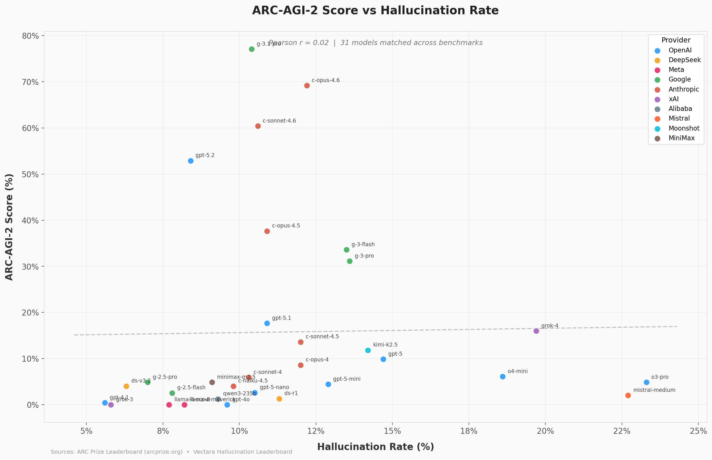
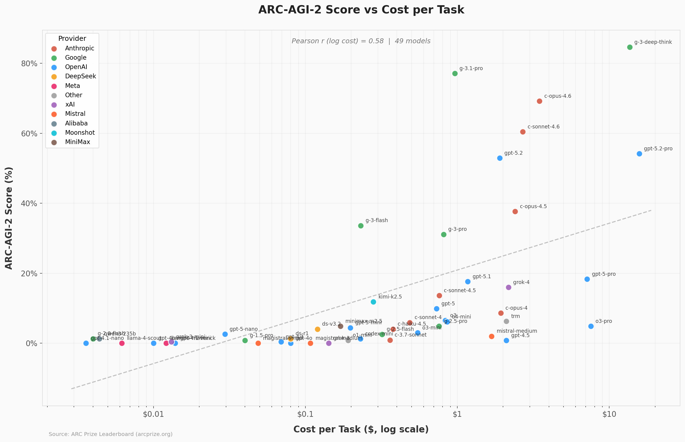
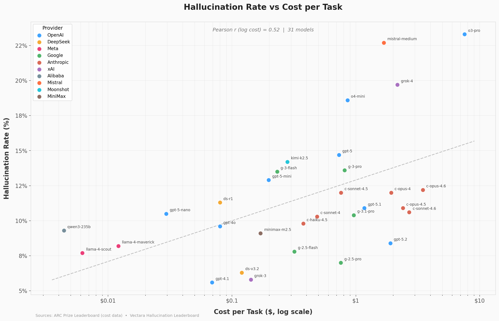

# LLM Comparison: ARC-AGI-2 vs Hallucination Rate

Comparing LLM performance on abstract reasoning (ARC-AGI-2) against hallucination rate (Vectara) to explore whether factual consistency predicts reasoning ability.

## Key Findings

### ARC-AGI-2 Score vs Hallucination Rate (r = 0.02)


Essentially **no correlation**. A model being more factual on summarization tasks does not predict its ability to solve abstract reasoning puzzles. These benchmarks measure fundamentally different capabilities.

### ARC-AGI-2 Score vs Cost per Task (r = 0.58)


**Moderate positive correlation**. More expensive compute (longer chain-of-thought, larger models) generally buys better reasoning performance. Gemini 3.1 Pro stands out as the best value at $0.96/task with 77% accuracy.

### Hallucination Rate vs Cost per Task (r = 0.52)


Counterintuitively, **more expensive models tend to hallucinate more**. Likely because pricier reasoning models generate longer outputs with more opportunities for hallucination on summarization tasks.

## Data Sources

### ARC Prize Leaderboard
- **URL:** https://arcprize.org/leaderboard
- **What it measures:** Performance on ARC-AGI-2, a benchmark of abstract reasoning tasks designed to test general intelligence. Models are scored on percentage of tasks solved correctly.
- **Files:**
  - `data/evaluations.json` - Score and cost-per-task for each model/dataset combination
  - `data/models.json` - Model metadata (provider, release date, type, paper/code URLs)
  - `data/providers.json` - Provider names and display colors
  - `data/datasets.json` - Dataset version definitions (ARC-AGI-1, ARC-AGI-2, public/semi-private/private splits)
- **API endpoints:**
  - `https://arcprize.org/media/data/leaderboard/evaluations.json`
  - `https://arcprize.org/media/data/models.json`
  - `https://arcprize.org/media/data/providers.json`
  - `https://arcprize.org/media/data/datasets.json`

### Vectara Hallucination Leaderboard (Hughes Hallucination Eval)
- **URL:** https://huggingface.co/spaces/vectara/leaderboard
- **What it measures:** Hallucination rate on document summarization across 10 domains (business, education, finance, law, medicine, politics, science, sports, stocks, technology). Models are given a document and asked to summarize it; the hallucination rate is the percentage of generated summaries containing fabricated information.
- **File:** `vectara_hallucination_leaderboard.csv`

## Model Key Mapping

The two datasets use different naming conventions for the same models. A `model_key` field was added to both datasets to enable joining:

| model_key | ARC example | Hallucination example |
|---|---|---|
| `claude-opus-4.6` | `claude-opus-4-6-thinking-120K-high` | `anthropic/claude-opus-4-6-` |
| `gpt-5.2` | `gpt-5-2-2025-12-11-thinking-high` | `openai/gpt-5.2-low-2025-12-11` |
| `gemini-2.5-pro` | `gemini-2-5-pro-2025-06-17-thinking-32k` | `google/gemini-2.5-pro-` |

- **31 models** have entries in both datasets and can be compared directly
- ARC models with multiple thinking-budget variants (e.g. low/medium/high/max) share the same `model_key` since hallucination is benchmarked once per base model
- 8 ARC-only models are competition/custom entries (Human Panel, ARChitects, Icecuber, etc.) without hallucination benchmarks

## How to Update the Data

### Refresh ARC Prize data
```bash
curl -o data/evaluations.json https://arcprize.org/media/data/leaderboard/evaluations.json
curl -o data/models.json https://arcprize.org/media/data/models.json
curl -o data/providers.json https://arcprize.org/media/data/providers.json
curl -o data/datasets.json https://arcprize.org/media/data/datasets.json
```

### Refresh Vectara hallucination data
Download the latest CSV from the [Vectara Hallucination Leaderboard](https://huggingface.co/spaces/vectara/leaderboard) and save as `vectara_hallucination_leaderboard.csv`.

### Re-add model keys
After refreshing either dataset, the `model_key` mapping needs to be reapplied. The mapping logic maps each dataset's model identifiers to a canonical short name (e.g. `claude-opus-4.6`, `gpt-5.2`). New models will need to be added to the mapping manually.

## Project Structure
```
.
├── README.md
├── vectara_hallucination_leaderboard.csv   # Hallucination benchmark (with model_key column)
├── data/
│   ├── evaluations.json                    # ARC-AGI scores & costs (with model_key field)
│   ├── models.json                         # Model metadata
│   ├── providers.json                      # Provider info
│   └── datasets.json                       # Dataset version definitions
├── arc_vs_hallucination.png                # Score vs hallucination scatter
├── arc_vs_cost.png                         # Score vs cost scatter
└── cost_vs_hallucination.png               # Cost vs hallucination scatter
```
